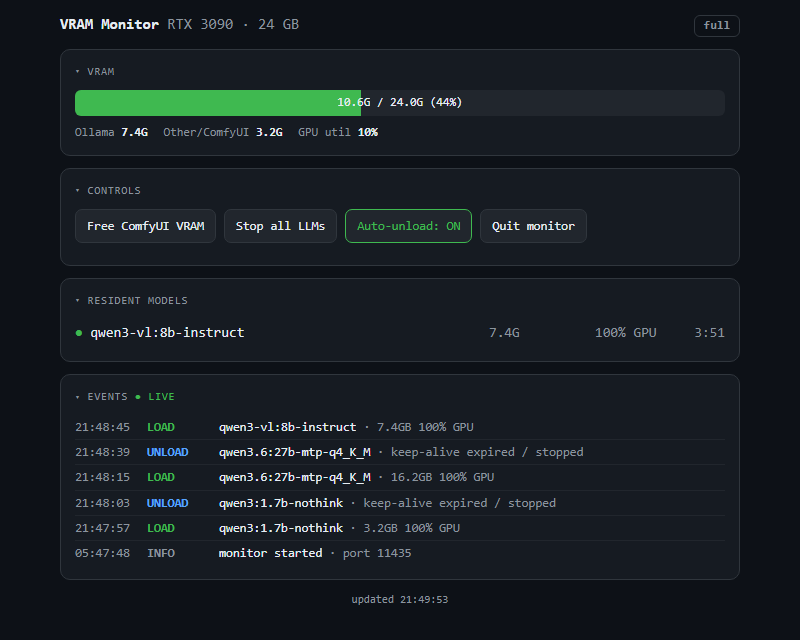

# VRAM Monitor

A small local web dashboard that shows what is actually occupying your GPU's
memory, reclaims it from whichever process has gone idle, and — since the
admission gate was added — makes competing workloads take turns instead of
trampling each other.

Built for a single-GPU machine running more than one AI workload — an LLM server
and an image generation server competing for the same 24 GB — where the practical
question is never "how much VRAM is used" but "which of these is holding it, and
can I get it back without restarting anything."

Stdlib only. No pip install, no framework, no config file.



## What it does

- Polls Ollama's `/api/ps` for precise per-model VRAM usage and GPU/CPU split.
- Polls `nvidia-smi` for total board usage and which processes are attached.
- Serves a phone-friendly dashboard with a live event log of loads and unloads.
- Runs a watchdog that frees ComfyUI's VRAM after a configurable idle period,
  so an image model left loaded hours ago stops crowding out the LLM.
- **Gates every Ollama request that would load a model**, holding it until the
  VRAM actually exists rather than letting the driver page someone else out.
- Exposes manual controls — free ComfyUI now, stop LLMs, toggle auto-unload,
  quit — so it can run hidden at login with no console window.

## The interesting part: you cannot measure this directly on Windows

On consumer GPUs under Windows' WDDM driver model, **`nvidia-smi` cannot report
per-process VRAM.** It will tell you the board is holding 21 GB and list the
processes attached, but not how much each one holds. That is precisely the number
you need to decide what to reclaim.

Ollama reports its own usage accurately through its API, so the workaround is to
treat everything else as a residual:

```
other_vram = board_used - ollama_reported
```

Loads and unloads by the non-API process are then inferred from jumps in that
residual rather than observed directly.

This works, but the signal is noisy in exactly one place: during an Ollama load or
unload, the residual moves for reasons that have nothing to do with ComfyUI, which
would otherwise produce false attributions. Two mitigations handle it:

- **Settle cycles** — after any known Ollama load or unload, attribution to
  "other" is suppressed for a few polls while the allocator settles.
- **Recency check** — a drop in the residual is only credited to ComfyUI if
  ComfyUI actually generated something recently. Otherwise it is left
  unattributed rather than guessed at.

The general principle: when a measurement is unreliable, it is better to
abstain than to attribute confidently and be wrong. A dashboard that says
"unknown" is more useful than one that says the wrong thing.

## The admission gate

Watching contention is not the same as preventing it. Windows will happily let a
second process allocate VRAM the card does not have, silently spilling the first
process into system memory — so contention shows up as a 10× slowdown rather than
an error. Nothing fails; everything just crawls.

The thing that makes arbitration practical here is that **every GPU consumer
except ComfyUI reaches the card through Ollama's HTTP API.** That is one choke
point, so the monitor sits in front of it:

```
clients ──→ :11434  gate (this program) ──→ :11436  ollama
                    :11435  dashboard
```

Clients keep talking to `:11434` and need no configuration change at all.

**Requests are classified into three kinds:**

| Kind | Paths | Behaviour |
|---|---|---|
| Ungated | `/api/ps`, `/api/tags`, `/api/version`, `/api/show`, unknown paths | forwarded immediately — metadata must never queue |
| Release | `/api/generate`, `/api/chat` with `keep_alive: 0` | admitted instantly, never queued |
| Gated | `/api/generate`, `/api/chat`, `/api/embed`, `/v1/*` | admission test below |

The Release class is not a nicety. Those calls *free* VRAM. Queueing them behind
a wait-for-free-VRAM check would deadlock the only mechanism that produces free
VRAM.

**A gated request is admitted when** the model is already resident (no new
allocation), or when `free - RESERVE_MB` covers its estimated cost. Otherwise it
waits in a FIFO queue. Head-of-line blocking is deliberate: a small request must
not consume the headroom a larger queued one is waiting on.

**Cost estimates are learned, not guessed.** Every observed load records what
Ollama actually reported for that model, kept as a high-water mark in
`model-costs.json` and seeded on first run from the historical log. Under-estimating
is the harmful direction — it admits a request that then forces the very spill the
gate exists to prevent — while over-estimating only costs a little waiting. Delete
the file to reset after shrinking a model's `num_ctx`.

**The gate fails open, always.** A request held longer than `MAX_HOLD_SECONDS` is
forwarded anyway and logged as `FORCED`, and any internal error forwards
immediately. The cap is set below the shortest client timeout on the machine on
purpose: a queue that outlives its callers causes the exact failure it was built
to prevent.

**It gates, it does not evict.** Anything already resident is left alone. When
ComfyUI is generating while a large model holds VRAM, the dashboard says so and
offers the existing "Stop all LLMs" button — one click, still your decision.

### Why Ollama has to be started directly

`ollama app.exe` (the tray app) forces its child server onto the default port
regardless of `OLLAMA_HOST`, which would take `:11434` back from the gate. Worse,
Python sets `SO_REUSEADDR`, so on Windows both would bind the same port and
delivery between them becomes undefined.

So Ollama is started as `ollama.exe serve` with `OLLAMA_HOST=127.0.0.1:11436`
(see `StartOllamaGated.vbs`), and the gate refuses to share its port — a clash is
logged loudly as `gate NOT started` instead of silently half-working. A direct
`serve` still loads models 100% onto the GPU; the tray app is not needed for CUDA
discovery.

## Requirements

- Windows with an NVIDIA GPU (`nvidia-smi` on `PATH`)
- Python 3.9+
- [Ollama](https://ollama.com/) and/or [ComfyUI](https://github.com/comfyanonymous/ComfyUI)
  running locally — the dashboard degrades gracefully if either is absent
- For the gate: Ollama listening on `OLLAMA_PORT` rather than the default, so the
  gate can take `:11434`

## Usage

```sh
python vram_monitor.py
```

Then open <http://localhost:11435>. The console also prints your LAN and
Tailscale URLs if available, so the dashboard is reachable from a phone.

`Start-VRAMMonitor.bat` starts the server and opens the dashboard in a compact
always-on-top Chrome window. `Start-ComfyIdleUnload.bat` runs only the ComfyUI
watchdog, standalone. `StartOllamaGated.vbs` starts Ollama on the gated port with
no console window; put it in the Startup folder in place of the stock Ollama
shortcut.

If the dashboard is unreachable from another device, `Fix-Firewall.bat` removes
the accidental `pythonw.exe` block rule Windows creates when a firewall prompt is
dismissed, and allows inbound TCP 11435 from your LAN and Tailscale only — never
the public internet.

## Configuration

Constants at the top of `vram_monitor.py`:

| Setting | Default | Meaning |
|---|---|---|
| `PORT` | `11435` | Dashboard port |
| `HOST` | `0.0.0.0` | `127.0.0.1` restricts to this machine |
| `POLL_SECONDS` | `2` | Poll interval |
| `IDLE_MINUTES` | `5` | Idle time before ComfyUI's VRAM is freed |
| `AUTO_UNLOAD` | `True` | Watchdog on at startup |
| `OTHER_DELTA_MB` | `400` | Minimum residual change logged as an event |
| `SETTLE_CYCLES` | `4` | Polls to suppress attribution after a known load |
| `GATE_PORT` | `11434` | Port the gate listens on — where clients point |
| `OLLAMA_PORT` | `11436` | Where the real Ollama listens |
| `RESERVE_MB` | `1024` | Headroom never handed out |
| `MAX_HOLD_SECONDS` | `120` | Longest hold before failing open |
| `RESERVE_TTL` | `25` | Seconds an admitted allocation stays reserved |
| `BIG_MODEL_MB` | `6000` | Resident size that triggers the ComfyUI banner |
| `COST_FILE` | `model-costs.json` | Learned per-model VRAM costs |

## Notes

`HOST = 0.0.0.0` binds all interfaces so a phone can reach it. There is no
authentication — this is intended for a trusted LAN or a Tailscale network, not
the open internet. Bind to `127.0.0.1` if you only need local access.

Running the gate puts this program on the path of every LLM request on the
machine. It fails open on error and holds no state that matters, but if it is not
running, nothing is listening on `:11434` and clients will not reach Ollama. To
back the whole thing out: clear `OLLAMA_HOST`, restore the stock Ollama startup
shortcut, and no client ever needs to change.

## License

MIT
